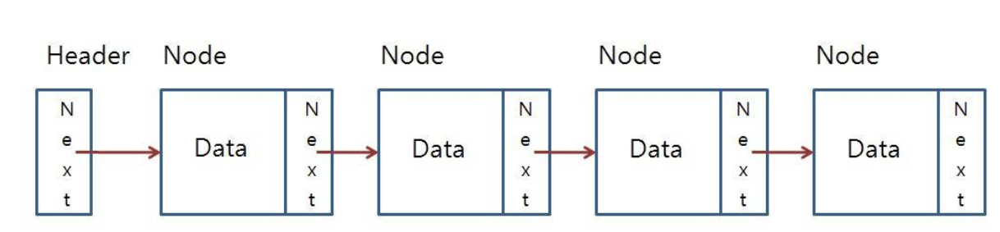

= 05. 연결 리스트(LinkedList)
연결리스트는 각 노드가 데이터와 포인터를 가지고 한 줄로 연결되어 있는 방식의 자료구조다
</img><br/> 

## 특징
- 자료의 주소 값으로 노드를 이용해 서로 연결되어 있는 구조를 갖는다.
- 트리의 근간이 되는 자료구조이다.

## 사용방법
```java
LinkedList list = new LinkedList();						//타입 미설정 Object로 선언
LinkedList<Student> members = new LinkedList<Student>();//타입설정 Student객체만 사용가능
LinkedList<Integer> num = new LinkedList<Integer>();	//타입설정 int타입만 사용가능
LinkedList<Integer> num2 = new LinkedList<>();			//new에서 타입 파라미터 생략가능
LinkedList<Integer> list2 = new LinkedList<Integer>(Arrays.asList(3,7));//생성시 값추가
```
## 시간복잡도
**INSERT/DELETE**   
- 배열의 맨 앞에 삽입/삭제하는 경우 : O(1)   
- 배열의 맨 뒤에 삽입/삭제 : O(1)   
- 배열의 중간에 삽입/삭제 : O(n)   

**SEARCH** : O(n)   

## 장점
- 자료의 삽입/삭제가 용이하다.
- List 내에서 자료의 이동이 필요하지 않다(Array는 필요)
- 사용 후 기억 장소의 재사용이 가능하다.

## 단점
- 포인터의 사용으로 인해 저장 공간의 낭비가 있다.
- 알고리즘이 복잡하다.
- 특정 자료의 탐색 시간이 많이 소요된다.

## 예
```java
import java.util.Iterator;
import java.util.LinkedList;

public class LinkedExample {
	public static void main(String[] args) {
		LinkedList<Integer> list = new LinkedList<>();
		
		list.addFirst(3);	//가장 앞에 데이터 추가
		list.addLast(5);	//가장 뒤에 데이터 추가
		list.add(6);		//데이터 추가
		list.add(7);		//데이터 추가
		list.add(1, 4);		//index 1뒤에 데이터 10 추가
		list.removeFirst(); //가장 앞의 데이터 제거
		list.removeLast(); 	//가장 뒤의 데이터 제거
		list.remove(); 		//생략시 0번째 index제거
		list.remove(1); 	//index 1 제거
		list.clear(); 		//모든 값 제거
		list.add(2);
		list.add(3);
		list.add(4);
		
		// list 요소 확인
		for(int el: list) {
			System.out.print(el+" ");
		}
		System.out.println();
		
		// Iterator선언, 요소 확인
		Iterator<Integer> iter = list.iterator();
		while(iter.hasNext()) {
			System.out.print(iter.next()+" ");
		}
		
		// list 사이즈 확인
		System.out.println("\nList 크기 : " + list.size());
		
		// 값 검색
		System.out.println("1값을 포함하는가? : " + list.contains(1));
		System.out.println("4값을 포함하는가? : " + list.contains(4));
		System.out.println("1이 있는 index는? :" + list.indexOf(1));
		System.out.println("4가 있는 index는? :" + list.indexOf(4));
	}
}
```
