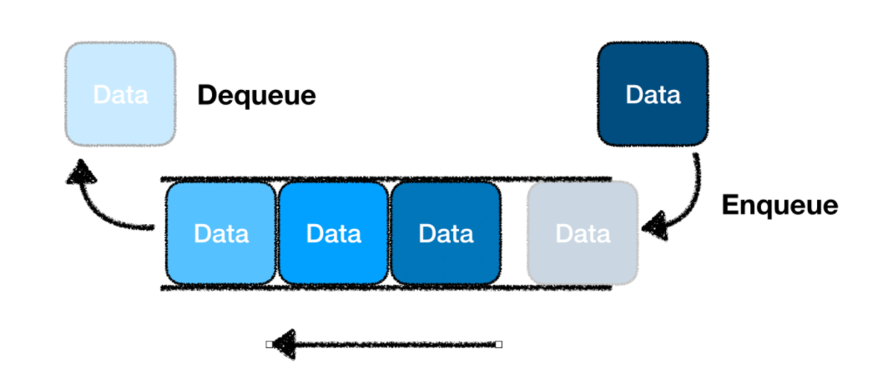

# 03. 큐(Queue)



## 특징
먼저 넣은 데이터가 먼저 나오는 구조

- FIFO(First-in, First-out) 구조
- 큐의 한쪽 끝은 Front로 삭제연산만 수행, 다른 한쪽은 Rear로 삽입 연산만 수행

## 사용방법
- **add(E item) / offer(E item)**    
  :큐에 item 값을 추가한다.
- **poll()**   
  :큐의 첫번째 값을 반환하고 제거. 비어있으면 null
- **remove()**   
  :큐의 첫번째 값 제거
- **clear()**   
  :큐 초기화
     
```java
import java.util.LinkedList;
import java.util.Queue;

Queue<Integer> queue = new LinkedList<>(); 	//int형 queue 선언, linkedlist 이용
Queue<String> queue = new LinkedList<>(); 	//String형 queue 선언, linkedlist 이용
```	

## 시간복잡도
**Insertion** O(1)   
**Deletion** O(1)   
**Search** O(n)   

## 장점
- 데이터의 삽입/삭제가 빠르다. O(1)

## 단점
- queue의 중간에 위치한 데이터로의 접근이 어렵다.
참고) 배열로 구현했을 때,
	- 선형 큐 
	1) Front는 고정, Back을 이동하면서 데이터를 삭제하는 경우
		: 데이터를 제거했을 때, 나머지 데이터를 한 칸씩 다 옮겨야 함.
	2) 둘 다 이동하면서 삽입, 삭제를 할 경우 
		: 배열의 끝에 저장되어 있는 상황이 되면, Back을 더 이상 이동시킬 수 없어서 overflow 발생.
	- 순환 큐(환형 큐) 
	: 선형 큐를 보완하기 위한 방식. front가 큐의 끝에 닿으면 큐의 맨 앞으로 자료를 보내서 원형으로 연결.

## 배열의 사용
- 데이터를 입력된 순서대로 처리해야 할 때
- BFS(너비 우선 탐색) 구현할 때

## 예
```java
import java.util.LinkedList;
import java.util.Queue;

Queue<Integer> queue = new LinkedList<>(); 	//int형 queue 선언, linkedlist 이용
queue.offer(1);
queue.offer(2);
queue.offer(3);
queue.poll();
```
